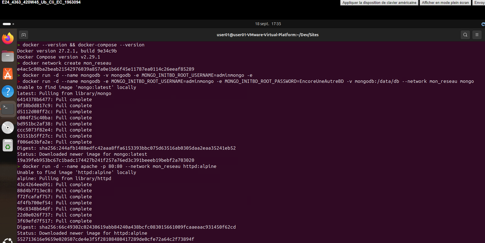

# TP2-Installation-serveur
#### Élie Caron (1963094)
#### 18-09-2024

### Description

Dans ce TP2 d'installation de serveur et service, nous allons énumérer étapes par étapes comment installer un système de conteneur en respectant les procédures et les méthodes de configuration sécuritaire.

## Section 1 - étape 1
### Vérification de l'installation :


## Section 1 - étape 2
### Création de conteneur :

```bash
docker network create mon_reseau
docker run -d --name mongodb -e MONGO_INITDB_ROOT_USERNAME=adminmongo -e MONGO_INITDB_ROOT_PASSWORD=EncoreUneAutreBD -v mongodb:/data/db --network mon_reseau mongo
```

```bash
docker run -d --name apache -p 80:80 --network mon_reseau httpd:alpine
```

```bash
docker network inspect mon_reseau
```

```bash
docker container logs apache
```

